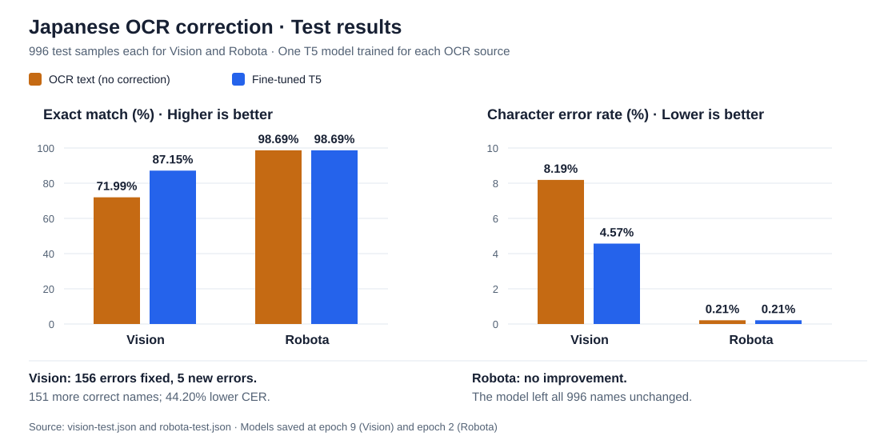

# Japanese OCR Post-Correction

[](https://www.python.org/)
[](https://pytorch.org/)
[](https://huggingface.co/retrieva-jp/t5-base-medium)
[](LICENSE)

This project is based on the paper [JaPOC: Japanese Post-OCR Correction Benchmark using Vouchers](https://arxiv.org/abs/2409.19948).

In this project, I fine-tuned a Japanese T5 model to correct OCR mistakes in company names. The input is the name of the company obtained from an OCR system. The model's output is a suggested name correction. The model is trained on and works with Japanese text.

I used [Retrieva's Japanese T5 model](https://huggingface.co/retrieva-jp/t5-base-medium) and the [JaPOC dataset](https://github.com/FastAccounting/ocr_correction_benchmark), training one model on Vision OCR text and another on Robota OCR text. This repo includes the model, training and evaluation code, along with MLflow tracking and API code (FastAPI). FastAPI and MLflow are optional, and the model can be used without them.



*Brown: OCR text without correction. Blue: the output from fine-tuned T5. 996 test samples each for Vision and Robota.*

[Vision results](results/vision-test.json) · [Robota results](results/robota-test.json)

[Setup](#setup) · [Training](#training) · [MLflow Tracking](#mlflow-tracking) 

## Results

I evaluated each model on **996 test samples**. These samples were not used during training or to choose the best model. The Vision model was evaluated on Vision OCR text, and the Robota model on Robota OCR text.

The comparison below is between the OCR text without any correction and the output from the fine-tuned model.

| OCR source | Method | Exact match ↑ | Character error rate ↓ | Errors fixed | New errors |
|---|---|---:|---:|---:|---:|
| Vision | OCR text (no correction) | 71.99% | 8.19% | — | — |
| Vision | Fine-tuned T5 | **87.15%** | **4.57%** | 156 | 5 |
| Robota | OCR text (no correction) | 98.69% | 0.21% | — | — |
| Robota | Fine-tuned T5 | 98.69% | 0.21% | 0 | 0 |


- **Exact match**: the percentage of names that match the correct spelling exactly. 
- **Character error rate (CER)**: the total number of character insertions, deletions, and substitutions needed to match the correct spellings, divided by the total number of characters in those spellings. Lower CER is better.
- **New errors**: counts names that the OCR read correctly but the model changed to an incorrect name.

Every prediction finished within the output token limit.

### Training and validation

I trained both models for 10 epochs. After each epoch, I evaluated them on 498 validation samples and saved the model with the highest exact-match score. Vision's best result was at **epoch 9**: 88.15%, up from 70.88% for the original OCR. Robota reached 98.39% at **epoch 2**, the same as its original OCR. Later epochs returned a similar score, so the earlier checkpoint was kept.


## Model and data

- **Model:** [retrieva-jp/t5-base-medium](https://huggingface.co/retrieva-jp/t5-base-medium), a pretrained Japanese T5 v1.1 model from Retrieva, available on Hugging Face. It was pretrained on Japanese Wikipedia and mC4/ja.
- **Tokenizer:** the SentencePiece-based T5 tokenizer from the same Retrieva model. The code loads it with `use_fast=False`. It converts the OCR text and correct spelling into tokens and is saved with the fine-tuned model.
- **Dataset:** [JaPOC](https://github.com/FastAccounting/ocr_correction_benchmark), from Masato Fujitake at Fast Accounting. Vision and Robota each have **9,457 training, 498 validation, and 996 test samples**. They contain text read by different OCR systems from the same documents.


## Setup

Clone the repository and run these commands from its root. You need **Python 3.11 or 3.12** and [uv](https://docs.astral.sh/uv/getting-started/installation/). (pip works too but I chose uv for its faster performance).

```bash
# NVIDIA GPU on Linux / WSL2
uv sync --locked --extra cuda --extra tracking

# Or CPU
uv sync --locked --extra cpu --extra tracking
```

If you need to perform additional troubleshooting, the repo also includes the devcontainer files I used during my development.

## Training

The Vision and Robota training, validation, and test datasets are available under the `data` folder.

The following are the train settings I used for both models. To train on Vision:

```bash
uv run --no-sync python -u -m app.train \
  --train data/japoc/vision/train.json \
  --val data/japoc/vision/val.json \
  --output runs/vision \
  --base-model retrieva-jp/t5-base-medium \
  --epochs 10 \
  --batch-size 32 \
  --eval-batch-size 32 \
  --learning-rate 5e-5 \
  --device cuda
```

The training loop uses AdamW and a manual random seed of 42. Each epoch goes through all training samples, followed by evaluation on the validation data. The model with the highest validation exact match and its tokenizer are saved in `runs/vision/model`. The run folder also contains `report.json` with the metrics and `predictions.json` with the best model's validation predictions.

Use a new output folder for each run. If your GPU runs out of memory, lower the batch size. This may change the results. To train on CPU, use `--device cpu`, though it will be much slower.

Once training finishes, evaluate the saved model on the test data:

```bash
uv run --no-sync python -m app.evaluate \
  --model runs/vision/model \
  --data data/japoc/vision/test.json \
  --output runs/vision-test \
  --batch-size 32 \
  --device cuda
```

To train on Robota, download it with `--ocr robota` and replace `vision` with `robota` in the training and evaluation paths above.


## MLflow Tracking

MLflow can be used to compare training runs. The training script saves results locally. The tracking script adds those results to MLflow tracking after training finishes.

If you do not already have a server running:

```bash
uv run --no-sync mlflow server \
  --host 127.0.0.1 --port 5000 \
  --backend-store-uri sqlite:///mlflow.db \
  --serve-artifacts --artifacts-destination ./mlartifacts
```

In another terminal, upload the completed training run:

```bash
export MLFLOW_TRACKING_URI=http://127.0.0.1:5000
uv run --no-sync python -m app.tracking --run runs/vision
```

Open **http://127.0.0.1:5000** and choose `japanese_ocr_post_correction` to see the training loss and validation scores for each epoch. Exact match and CER are stored as ratios in MLflow (for example, `0.8815` means `88.15%`). Add `--upload-model` to save the weights in MLflow too. Running the script again creates another MLflow run. It does not upload the separate test results.

If you use the devcontainer, can directly open MLflow at `http://127.0.0.1:5000` in your browser.

## Credits and license

The application code and tutorials are [MIT licensed](LICENSE). Data and model weights keep their own licenses:

- **Masato Fujitake / Fast Accounting:** [JaPOC dataset](https://github.com/FastAccounting/ocr_correction_benchmark) and [paper](https://arxiv.org/abs/2409.19948). The dataset repository uses Apache-2.0 license.
- **Retrieva:** [Japanese T5 weights](https://huggingface.co/retrieva-jp/t5-base-medium), under CC-BY-SA-4.0.
- **Colin Raffel and coauthors:** the original [T5 research](https://www.jmlr.org/papers/v21/20-074.html).


This is an independent project, not an official Fast Accounting or Retrieva product. The MIT license covers this project's code. It does not the dataset or model weights.